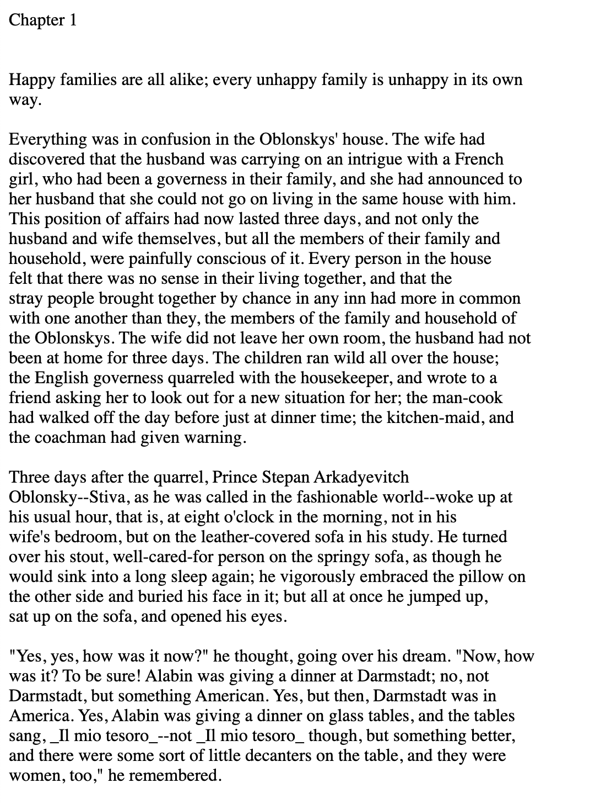
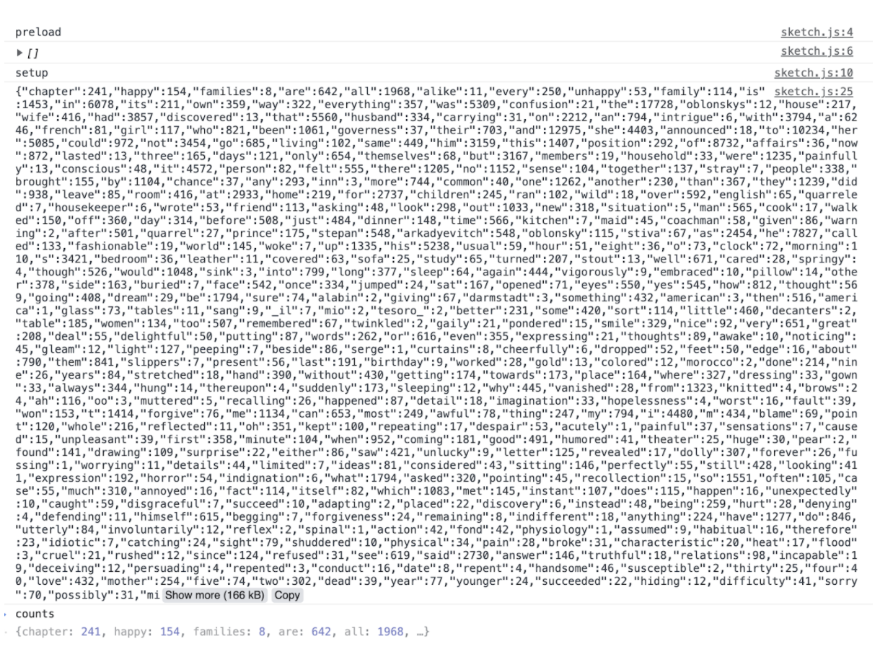
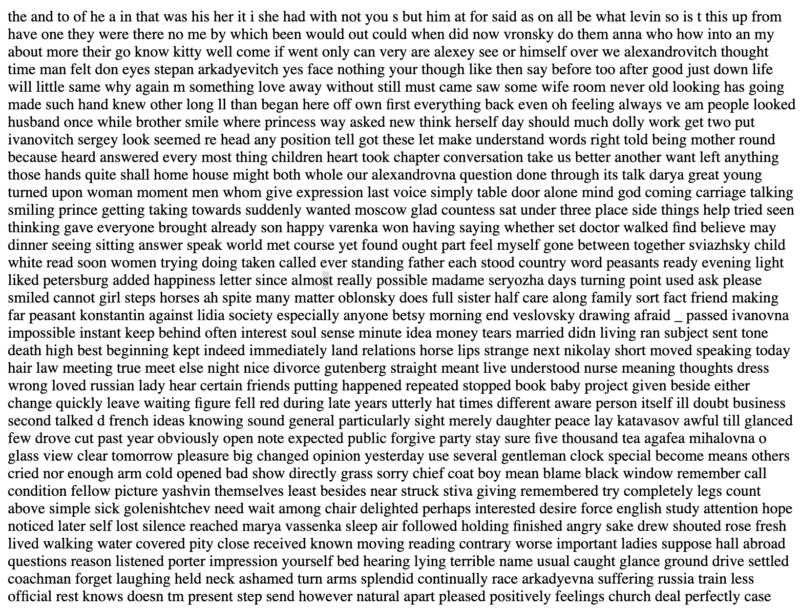
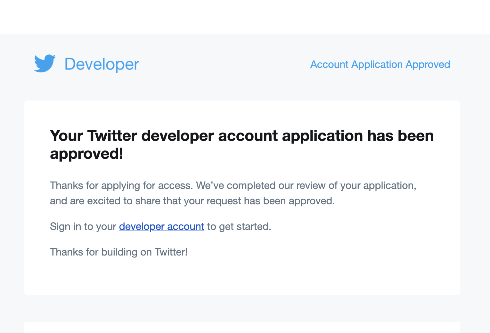
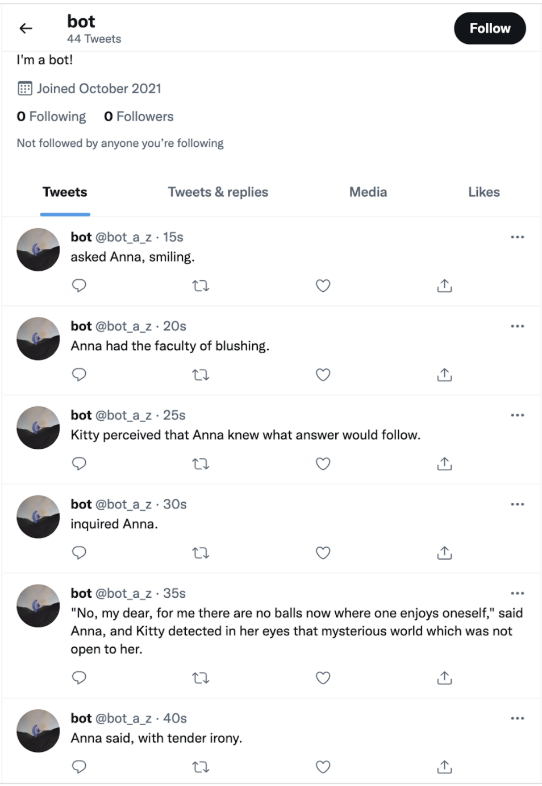
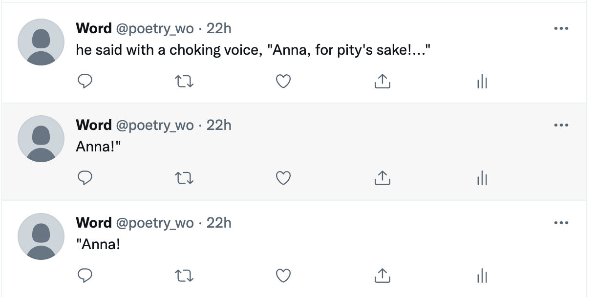
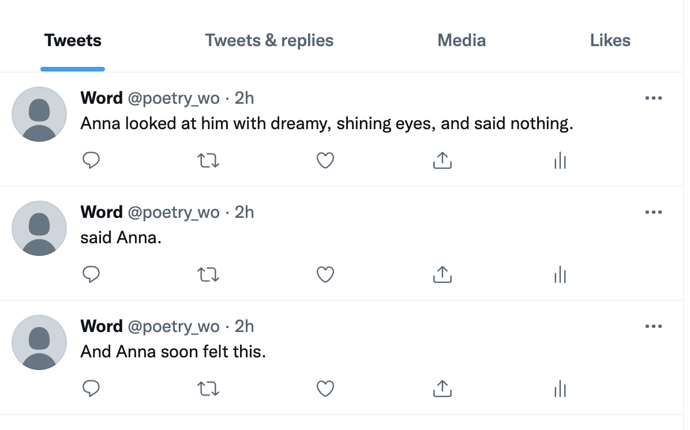

# Anna-Karenina-Twitter-Bot

I was intersted of working with books and texts. I had a discussion last week with my best friend for an hour when we tried to decide if Anna Kernina is the best book ever written. We didn't come to any coclusion but I had an idea of a text I want to play with.

I started by loading the text using the Gutenberg Project.

Next step was of course, counting all the words.

I had an idea of writing Anna Kernina again using each word only once. I used Rita function to do this- untokenize and sentences, to build sentences out of the words. I found the result compelling, but the next step was making pergraph out of it. I tried using CreateP but I was coming up with a lot of errors.

In the meantime, I was fighting to get twitter approval for a dev account. I wrote them 3 emails but nothing worked. Eventually Dave helped me write a long email that had all the right key words and their AI approved my account in a couple of hours.

Instead of re-writing the whole book as I intended, I decided to have a bot only about Anna, that will tweet all the sentnces with the word Anna.
One technical challenge I had was writing a for loop that will push all the Anna sentences into a loop, but dave tought me a new loop concept- forEach:
//sentences.forEach((sentence) => {
  //const regex = /Anna/g;
  //const found = sentence.match(regex);
  
This was a great thing to learn and very usefull for the future!

With some more help from Dave my bot was alived-
  

and here are some favorite moment-

Next steps for this would be to open another account with the name Anna and the picture, and let it run a line each day. I am very curious to see how many days it will last and if it will get any followers.
Another idea I have is to create visualization of all the four main charcter, using more of Rita and P5.
